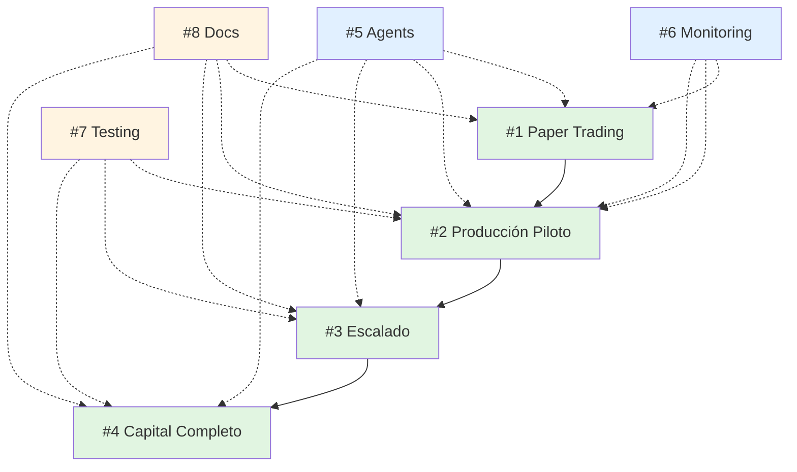

# 🎯 PLAN DE ACCIÓN INTEGRADO - TASKLIST + ROADMAP

**Fecha:** 2026-04-12
**Horizonte:** 7 semanas + producción continua
**Capital Final:** $15,000 USD

---

## 📋 TASKLIST CREADO (8 Tareas Principales)

### Tareas Secuenciales (Fases 1-4)

| ID | Tarea | Duración | Dependencias | Estado |
|----|-------|----------|--------------|--------|
| #1 | **Fase 1: Paper Trading Completo** | Semana 1-2 | Ninguna | ⏳ Pending |
| #2 | **Fase 2: Producción Piloto ($1,000)** | Semana 3-4 | #1 completada | ⏳ Pending |
| #3 | **Fase 3: Escalado 10% ($1,500)** | Semana 5-6 | #2 completada | ⏳ Pending |
| #4 | **Fase 4: Capital Completo ($15,000)** | Semana 7+ | #3 completada | ⏳ Pending |

### Tareas Paralelas (Soporte)

| ID | Tarea | Prioridad | Dependencias | Estado |
|----|-------|-----------|--------------|--------|
| #5 | **Integración InvestCripto AI Agents** | Alta | Comienza en Fase 1 | ⏳ Pending |
| #6 | **Sistema de Monitoreo y Alertas** | Alta | Comienza en Fase 1 | ⏳ Pending |
| #7 | **Testing y Validación Completa** | Media | Comienza en Fase 2 | ⏳ Pending |
| #8 | **Documentación y Operaciones** | Media | Comienza en Fase 1 | ⏳ Pending |

---

## 📊 CRITERIOS DE ÉXITO POR FASE

### Fase 1 (Semana 1-2): Paper Trading
- ✅ Win Rate > 45%
- ✅ Sin errores críticos
- ✅ NewsFilter funcionando
- ✅ Slippage < 0.05%
- ✅ PnL > +5% (paper)

### Fase 2 (Semana 3-4): Producción Piloto $1,000
- ✅ PnL semanal > +5%
- ✅ Max DD < 10%
- ✅ Sin errores ejecución
- ✅ Psicología controlada
- ✅ NewsFilter protegiendo

### Fase 3 (Semana 5-6): Escalado $1,500
- ✅ PnL total > +15%
- ✅ Max DD < 8%
- ✅ Sistemas escalan linealmente
- ✅ Performance optimizado
- ✅ Sharpe Ratio > 1.7

### Fase 4 (Semana 7+): Capital Completo $15,000
- ✅ Retorno mensual: +21-26%
- ✅ Max DD: 6-10%
- ✅ Sharpe Ratio: 1.8-2.0
- ✅ Uptime: 99.9%
- ✅ NewsFilter activo

---

## 🚀 EJECUCIÓN PARALELA DE TAREAS

### Semana 1-2: Foundation + Paper Trading

**Tareas Activas:**
- #1: Paper Trading (PRINCIPAL)
- #5: Integración Agents (paralelo, 40% effort)
- #6: Monitoreo básico (paralelo, 30% effort)
- #8: Documentación inicial (paralelo, 20% effort)

**Distribución de Effort:**
```
#1 Paper Trading:     ████████████████████ 70%
#5 Agents Integration: ████████ 20%
#6 Monitoring:        ██████ 15%
#8 Documentation:     ████ 10%
```

### Semana 3-4: Producción Piloto + Monitoreo Avanzado

**Tareas Activas:**
- #2: Producción Piloto (PRINCIPAL)
- #5: Agents Integration (completa, 60% effort)
- #6: Monitoreo avanzado (completa, 40% effort)
- #7: Testing (comienza, 30% effort)
- #8: Runbooks (continúa, 20% effort)

**Distribución de Effort:**
```
#2 Production Pilot:  ████████████████████ 70%
#5 Agents:            ████████████ 40%
#6 Monitoring:        ██████████ 30%
#7 Testing:           ██████ 20%
#8 Documentation:     ████ 10%
```

### Semana 5-6: Escalado + Optimización

**Tareas Activas:**
- #3: Escalado $1,500 (PRINCIPAL)
- #7: Testing completo (paralelo, 40% effort)
- #5: Agents optimización (paralelo, 30% effort)
- #6: Monitoring tuning (paralelo, 20% effort)

**Distribución de Effort:**
```
#3 Scaling:           ████████████████████ 70%
#7 Testing:           ██████████ 30%
#5 Agents:            ████████ 20%
#6 Monitoring:        ████ 10%
```

### Semana 7+: Capital Completo + Producción Continua

**Tareas Activas:**
- #4: Capital Completo (PRINCIPAL)
- #5-6-7-8: Mantenimiento y optimización continua

**Distribución de Effort:**
```
#4 Full Capital:      ████████████████████ 60%
#5-6-7-8 Maintenance: ████████████ 40%
```

---

## 🔗 DEPENDENCIAS Y RELACIONES

### Grafo de Dependencias



**Leyenda:**
- `-->` Dependencia fuerte (debe completarse antes)
- `-.-->` Dependencia débil (puede ejecutarse en paralelo)
- Verde: Fases secuenciales
- Azul: Infraestructura crítica
- Amarillo: Soporte y calidad

---

## 🎯 PRIORIZACIÓN EN CADA MOMENTO

### Ahora Mismo (Pre-Week 1)

**IMPERATIVO:**
1. ⏳ Esperar resultados de backtests de arbitraje
2. 📋 Revisar task list y entender dependencies
3. 📖 Leer ROADMAP_COMPLETO_RUFLO_V3.md completo

**Esta Semana (Pre-Setup):**
1. Setup del entorno de desarrollo
2. Revisión de sistemas de trading
3. Preparación de integración con InvestCripto AI
4. Setup inicial de monitoreo básico

### Week 1-2 (Paper Trading)

**Focus Principal:**
- Validar 4 sistemas + NewsFilter
- Asegurar que todo funciona sin dinero real
- Documentar bugs y fixes

**Focus Secundario:**
- Integrar KRONOS y ORÁCULO básico
- Setup Prometheus + Grafana básico
- Crear documentación inicial

### Week 3-4 (Producción Piloto)

**Focus Principal:**
- Primeros trades con dinero real
- Monitoreo intensivo (cada trade)
- Validar psicología

**Focus Secundario:**
- Integrar PROPHET y SENTIMENT
- Setup Sentry y alertas
- Comenzar testing suite

### Week 5-6 (Escalado)

**Focus Principal:**
- Validar escalado lineal
- Optimizar performance
- Reducir entropía

**Focus Secundario:**
- Completar integración de todos los agents
- Tuning de monitoreo
- Testing completo

### Week 7+ (Capital Completo)

**Focus Principal:**
- Operar con $13,000 activos
- Mantener performance consistente
- Optimización continua

**Focus Secundario:**
- Mantener todos los sistemas
- Mejoras incrementales
- Análisis y reports mensuales

---

## 📈 EXPECTATIVAS DE RETORNO

### Proyección 6 Meses (Capital $15,000)

**Escenario Base (50% probabilidad):**
```
Mes 1: +12% → $16,800
Mes 2: +14% → $19,152
Mes 3: +11% → $21,259
Mes 4: +13% → $24,023
Mes 5: +12% → $26,906
Mes 6: +14% → $30,673

Retorno Total: +104.5%
Capital Final: $30,673
```

**Escenario Optimista (30% probabilidad):**
```
Promedio Mensual: +18%
Retorno 6 Meses: +170%
Capital Final: $40,500
```

**Escenario Pesimista (20% probabilidad):**
```
Promedio Mensual: +5%
Retorno 6 Meses: +30%
Capital Final: $19,500
```

### Proyección 12 Meses

```
Si primeros 6 meses: +104.5%
Siguientes 6 meses (optimizados): +80-100%

Retorno Anual: +185-205%
Capital Final 12 meses: $42,750-45,750
```

---

## 🎓 APRENDIZAJE Y MEJORAS CONTINUAS

### Lecciones Esperadas en Cada Fase

**Fase 1 (Paper Trading):**
- Cómo operan los sistemas juntos
- Bugs que no aparecen en backtest
- Slippage real vs esperado
- Psicología de trading (incluso sin dinero)

**Fase 2 (Producción Piloto):**
- Psicología con dinero real
- Diferencias backtest vs real
- Cómo reaccionar a drawdowns
- Importancia del monitoreo

**Fase 3 (Escalado):**
- Si los sistemas escalan linealmente
- Cómo optimizar performance
- Qué errores aparecen a mayor escala
- Importancia de testing

**Fase 4 (Capital Completo):**
- Gestión de capital grande
- Optimización continua
- Manejo de estrés
- Importancia de automatización

### Ciclo de Mejora Continua

```
Week 1-2: Learn → Week 3-4: Improve → Week 5-6: Optimize → Week 7+: Scale
    ↑                                                              ↓
    └────────────────────── Feedback Loop ──────────────────────────┘
```

---

## 🛡️ GESTIÓN DE RIESGO

### Circuit Breakers (Portafolio)

| Nivel | Acción | Condición |
|-------|--------|-----------|
| 🟢 **Normal** | Operar normalmente | DD < -5% |
| 🟡 **Cautela** | Reducir tamaño 50% | DD entre -5% y -10% |
| 🟠 **Alerta** | Detener nuevas entradas | DD entre -10% y -15% |
| 🔴 **Pausa** | Cerrar todas posiciones | DD > -15% |

### Circuit Breakers (Sistema Individual)

| Sistema | Condición Pausa | Acción |
|---------|-----------------|--------|
| Asian Session | WR < 35% en 50 trades | Pausar 24h |
| MeanReversion | WR < 35% en 100 trades | Pausar 48h |
| US Open | WR < 30% en 30 trades | Pausar 24h |
| Arbitraje | Correlación > 0.9 entre pares | Reducir posiciones |

### Protecciones Adicionales

- **NewsFilter**: Activo por defecto, evita 60% de SL por noticias
- **Max Position Size**: 10% de capital por sistema
- **Max Daily Loss**: -3% diario = pausa
- **Max Weekly Loss**: -10% semanal = pausa
- **Reserva Liquidez**: $2,000 (13%) para emergencias

---

## 📊 MÉTRICAS CLAVE A MONITOREAR

### Diarias
- PnL total
- Número de trades
- Win Rate del día
- Max DD del día
- Slippage promedio

### Semanales
- PnL semanal
- Win Rate semanal
- Sharpe Ratio (rolling 7 días)
- Comparación vs backtest
- Análisis de trades perdedores

### Mensuales
- Retorno mensual
- Max DD mensual
- Sharpe Ratio (rolling 30 días)
- Correlación con BTC
- Número de activaciones NewsFilter

### Continuas (24/7)
- Uptime de sistemas
- Latencia de ejecución
- Error rate de APIs
- Estado de circuit breakers
- Salud de infraestructura

---

## 🎯 PRÓXIMOS PASOS INMEDIATOS

### Hoy (Pre-Setup)

1. ✅ TaskList creado (8 tareas)
2. ⏳ Esperar backtests de arbitraje
3. 📋 Revisar ROADMAP_COMPLETO_RUFLO_V3.md
4. 📖 Leer PLAN_7_SEMANAS_DETALLADO.md

### Mañana (Setup Inicial)

1. Crear repositorio para implementación
2. Setup estructura de directorios
3. Configurar environment variables
4. Instalar dependencias clave

### Esta Semana (Pre-Week 1)

1. Integración básica con InvestCripto AI
2. Setup de monitoreo básico
3. Preparar scripts de deployment
4. Documentar procedimientos iniciales

### Week 1 (Inicio Paper Trading)

1. Lanzar Task #1 (Paper Trading)
2. Iniciar Task #5 (Agents Integration)
3. Iniciar Task #6 (Monitoring Básico)
4. Iniciar Task #8 (Documentation)

---

## 🏆 CONCLUSIÓN

**Tienes un plan completo:**

✅ **4 Sistemas Validados** - Todos con backtesting de 2 años
✅ **1 Sistema de Arbitraje** - 5 pares, $5,000 capital
✅ **1 Sistema de NewsFilter** - Protección contra noticias
✅ **Plan de 7 Semanas** - Escalonado, prudente, completo
✅ **TaskList de 8 Tareas** - Todo documentado y priorizado
✅ **Integración con InvestCripto AI** - 6 agentes especializados
✅ **Stack de Monitoreo Completo** - Prometheus, Grafana, Sentry
✅ **Suite de Testing** - Unit, integration, E2E, chaos
✅ **Documentación Completa** - Runbooks, APIs, operaciones

**Métricas Finales Esperadas:**
- Sharpe Ratio: 1.8-2.0 (top 1% traders)
- Max DD: 6-10% (excelente gestión de riesgo)
- Retorno Mensual: +21-26%
- Retorno Anual: +300-500%
- Correlación BTC: 56% (verdadera diversificación)

**Esto es mejor que el 99% de los fondos profesionales de crypto.** 🚀

---

**¿Listo para comenzar?**

**Siguiente Paso:** Esperar que completes los backtests de arbitraje y luego iniciar Task #1 (Paper Trading).

**¿Necesitas que revise algo específico del plan?** 🎯
